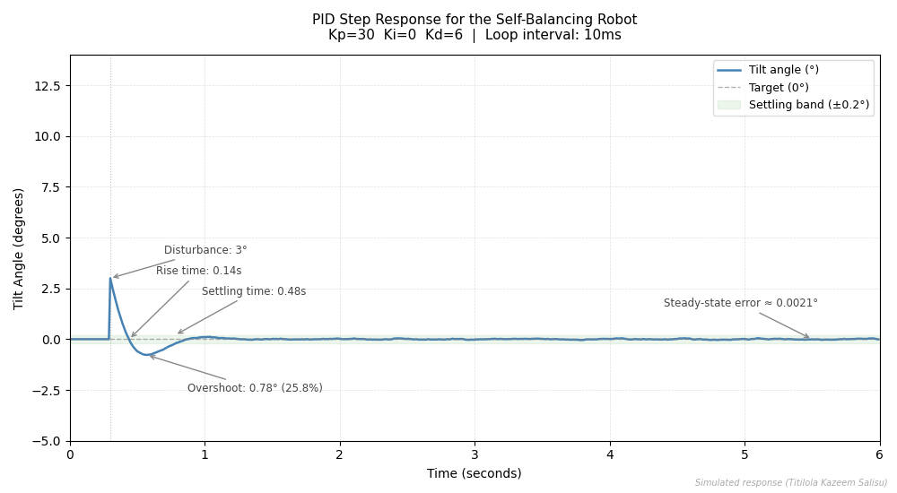

# Self-Balancing Robot PID Control
A two-wheeled robot is naturally unstable. Without active correction, it falls. This project implements a PID control system on an Arduino to keep the robot upright in real time by continuously reading the tilt angle from an MPU6050 sensor and adjusting motor speed accordingly. The results were validated using a digital twin built with serial data logged directly from the Arduino.


Read the full write-up here: [What Building a Self-Balancing Robot Taught Me After Many Days of Tuning](https://www.linkedin.com/in/salisutitilola123)

Want to see the system behaviour visualised in real time? Check out the [Self-Balancing Robot Digital Twin](https://github.com/i-am-the-robot/Self-Balancing-Robot-Digital-Twin) repository.

---

## Hardware Required

| Component | Quantity |
|---|---|
| Arduino Uno |        1 |
| MPU6050 Sensor |     1 |
| L298N Motor Driver | 1 |
| DC TT Gear Motors | 2 |
| 3.7V Li ion Battery | 2 |
| Jumper Wires | As needed |

---

## Wiring

| MPU6050 Pin | Arduino Pin |
|---|---|
| VCC | 3.3V or 5V |
| GND | GND |
| SDA | A4 |
| SCL | A5 |

| L298N Pin | Arduino Pin |
|---|---|
| IN1 | Pin 4 |
| IN2 | Pin 5 |
| IN3 | Pin 6 |
| IN4 | Pin 7 |
| ENA | Pin 10 (PWM) |
| ENB | Pin 11 (PWM) |
| VCC (12V) | Battery positive |
| VS (5V) | Arduino Vin |
| GND | Battery negative and Arduino GND |


Note: Your pin assignments may be different depending on how you wired your board. Check your code and adjust accordingly.

---

## Library Required

Install this library from the Arduino Library Manager before uploading the code:

```
MPU6050_light by rfetick
```

Go to Sketch > Include Library > Manage Libraries, search for MPU6050_light and install it.

---

## PID Values Used

```
Kp = 30  |  Ki = 0  |  Kd = 6  |  Sampling time T = 0.01s (10ms)
```

These values worked for my system. Every system is different. You will need to tune yours.

---

## Serial Output

The code prints the following to Serial Monitor at 9600 baud:

```
Angle: X    Error: Y    U: Z
```

You can use this output to monitor your system in real time or connect it to the digital twin visualiser.

---

## Tuning Sequence

This is the sequence that worked for me. I believe it will reduce the tuning time by following this order.

1. Start with Kp. Tune it until the bot responds fast enough to catch a fall without oscillating.
2. Tune Kd next. This dampens the oscillation introduced by Kp and prevents overshoot. Tune until the system is smooth.
3. Tune Ki last. Only add it if your system has a persistent drift that Kp and Kd cannot fix. Be careful. This is because too much Ki will cause error windup and make the system unstable. Mine worked without it.

---

## Key Things to Note

Make sure your MPU6050 is firmly screwed to the chassis. If it moves even slightly, the bot will never stabilise.

Make sure you are reading from the correct coordinate axis on the MPU6050. The wrong axis means no useful feedback.

You may need to adjust the desiredAngle value in the code to match your bot's Centre of Mass. If your components are not evenly distributed, the natural balance point of your bot will not be exactly 0°.

It will not work on the first try. It can be frustrating. Just keep tuning.

---

## Results

| Test | Result |
|---|---|
| Flat surface | Stable |
| Slightly inclined surface | Took longer to stabilise |
| 3° disturbance | Recovered in approximately 3 seconds |
| Maximum recoverable disturbance | 4° |
| Beyond 4° | Falls, 45° cutoff stops the motors |


---

## Future Work

- Kalman filter for smoother MPU6050 angle feedback
- Cascaded PID with separate loops for angle and velocity
- Remote setpoint interface for real-time monitoring

---

*Every system has its own parameter values. You must understand your system to know what will work for it.*

---

